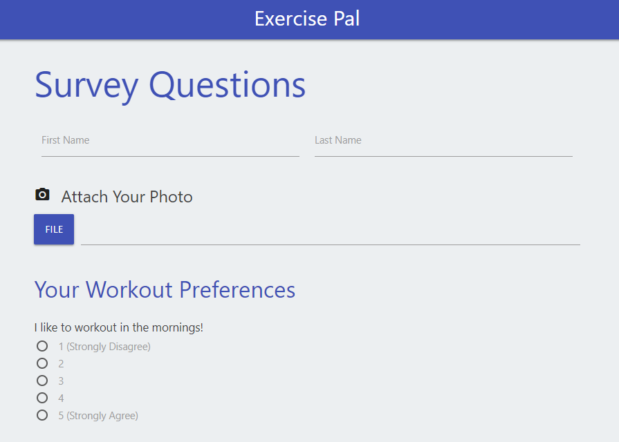

# ExercisePal

This full-stack website prompts users to fill out a survey about their exercise habits and goals. Then it compares their answers to other users and matches them with the most compatible workout partner. When users submit their answers, a modal pops up with the name of their new exercise pal.

## Links
* [Home] (https://serene-coast-70587.herokuapp.com/)
* [Survey] (https://serene-coast-70587.herokuapp.com/survey)
* [API Results] (https://serene-coast-70587.herokuapp.com/api/friends)

## Technologies Used
* Materialize
* Heroku
* JavaScript
* jQuery
* HTML5
* Node.js

### Node.js Packages Used
* express
* path